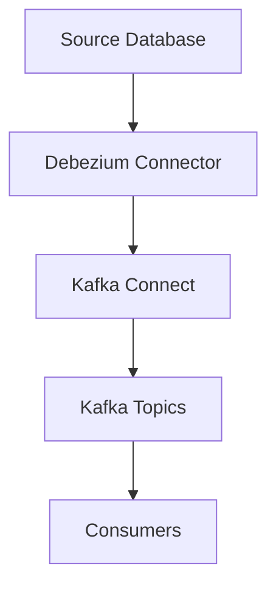
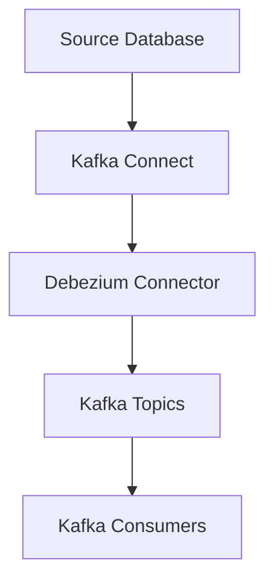
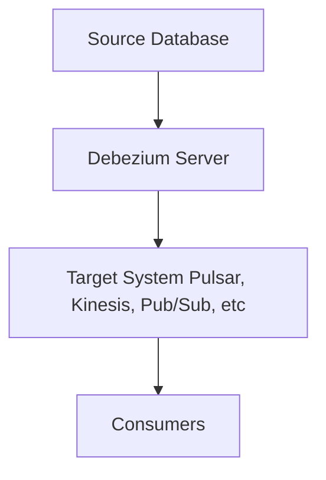
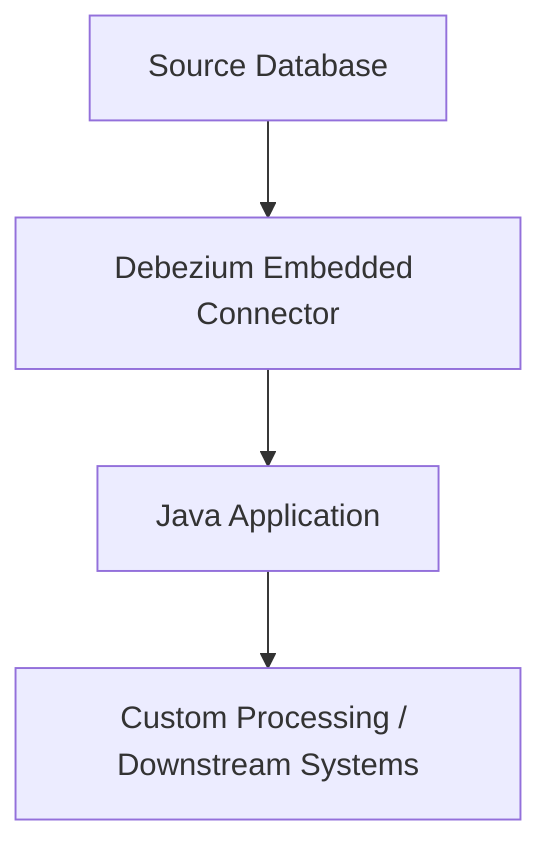

# Debezium: In-Depth Overview

## What is Debezium?

Debezium is an open-source distributed platform for Change Data Capture (CDC). It enables you to capture row-level changes in your databases and stream them to downstream consumers, such as Apache Kafka, in real time. Debezium is widely used for data integration, microservices synchronization, analytics, and event-driven architectures.

---

## Debezium Architecture

Debezium's architecture is built on top of Kafka Connect and consists of several key components:

### Components Explained

- **Source Database**: The database where data changes (inserts, updates, deletes) occur. Supported databases include MySQL, PostgreSQL, MongoDB, SQL Server, Oracle, and more.
- **Debezium Connector**: A specialized Kafka Connect connector that reads the database's transaction log (e.g., binlog for MySQL, WAL for PostgreSQL) to detect changes.
- **Kafka Connect**: A framework for scalable and fault-tolerant data integration with Kafka. It manages the lifecycle of Debezium connectors and handles data streaming.
- **Kafka Topics**: Each change event is published to a Kafka topic, typically one topic per table.
- **Consumers**: Applications or services that subscribe to Kafka topics to process, transform, or store the change events.

---

## How Debezium Works

1. **Connector Deployment**: Deploy a Debezium connector for your database using Kafka Connect.
2. **Change Detection**: The connector reads the database's transaction log to detect row-level changes.
3. **Event Generation**: Each change (insert, update, delete) is converted into a structured event (JSON or Avro format).
4. **Event Streaming**: Events are published to Kafka topics in real time.
5. **Consumption**: Downstream consumers (microservices, analytics platforms, search indexes, etc.) subscribe to these topics and react to changes.

---

## Debezium Deployment Modes

Debezium can be deployed in three main ways, depending on your architecture and integration needs:

### 1. Kafka Connect Mode (Most Common)
Debezium connectors run as plugins inside Kafka Connect. This is the standard and most scalable way to capture changes and stream them to Apache Kafka topics.

- **Best for:** Integrating with Kafka-based data pipelines, large-scale streaming, distributed/fault-tolerant setups.
- **Pros:** Scalable, managed, integrates natively with Kafka ecosystem.

### 2. Debezium Server Mode
Debezium Server is a standalone service that runs Debezium connectors and streams change events to systems other than Kafka (e.g., Pulsar, Kinesis, Google Pub/Sub, MQTT, etc.)

- **Best for:** Streaming CDC events to non-Kafka systems or cloud-native event buses.
- **Pros:** Flexible, supports many targets, no need for Kafka infrastructure.

### 3. Embedded Mode (Java Library)
Debezium connectors can be embedded directly into a Java application as a library. The application receives change events via callbacks or listeners.

- **Best for:** Lightweight, custom Java applications that need direct access to change events without external services.
- **Pros:** Simple, no external dependencies, full control in code.

---

## Summary Table

| Mode                | Use Case                                 | Output Targets                | Pros                        |
|---------------------|------------------------------------------|-------------------------------|-----------------------------|
| Kafka Connect       | Kafka-based streaming/data pipelines      | Kafka topics                  | Scalable, managed, robust   |
| Debezium Server     | Non-Kafka event streaming                | Pulsar, Kinesis, Pub/Sub, etc.| Flexible, cloud-native      |
| Embedded            | Custom Java app integration              | In-process (Java callbacks)   | Lightweight, simple         |

---

## Resources

- [Debezium Documentation](https://debezium.io/documentation/)
- [Debezium GitHub](https://github.com/debezium/debezium)
- [Kafka Connect Documentation](https://kafka.apache.org/documentation/#connect)
- [CDC Patterns (Martin Fowler)](https://martinfowler.com/articles/change-data-capture.html)

---
