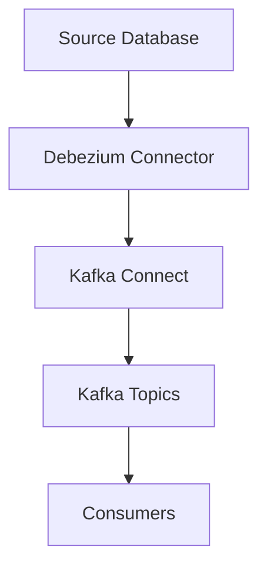

# Change Data Capture

## What is Change Data Capture (CDC)?

Change Data Capture (CDC) is a software design pattern used to identify and track changes (inserts, updates, deletes) in a data source, typically a database. CDC enables applications and systems to respond to data changes in real time or near real time, making it essential for data integration, replication, analytics, and event-driven architectures.

### Key Concepts

- **Source Database**: The original database where data changes occur.
- **Change Log**: A record of all changes made to the data (often implemented using database logs like binlog, WAL, redo log, etc.).
- **Capture Process**: The mechanism that reads changes from the change log.
- **Downstream Systems**: Systems that consume the captured changes (e.g., data warehouses, caches, search indexes, microservices).

### Why Use CDC?

- **Real-time Data Integration**: Keeps data synchronized across systems with minimal latency.
- **Event-driven Architectures**: Triggers business logic or workflows in response to data changes.
- **Auditing and Compliance**: Maintains a history of changes for regulatory or troubleshooting purposes.
- **Efficient ETL**: Only changed data is processed, reducing load and improving performance.

### CDC Implementation Approaches

1. **Query-based CDC**: Periodically queries the database for changes (e.g., using timestamps or version columns).
2. **Trigger-based CDC**: Uses database triggers to log changes to a separate table.
3. **Log-based CDC**: Reads changes directly from the database’s transaction log (binlog, WAL, etc.). This is the most efficient and least intrusive method.

---

## Debezium

Debezium is an open-source distributed platform for CDC. It captures row-level changes in your databases and streams them to downstream consumers (e.g., Apache Kafka).

### How Debezium Works

- **Connectors**: Debezium provides connectors for popular databases like MySQL, PostgreSQL, MongoDB, SQL Server, Oracle, and more.
- **Kafka Connect**: Debezium runs as a set of Kafka Connect connectors, reading changes from database logs and publishing them as Kafka topics.
- **Event Streams**: Each change (insert, update, delete) is published as an event, allowing consumers to react in real time.

### Debezium Architecture

### Benefits of Using Debezium

- **Non-intrusive**: No need to modify application code or database schema.
- **Scalable**: Built on Kafka Connect for distributed, fault-tolerant streaming.
- **Open Source**: Community-driven with support for many databases.
- **Schema Evolution**: Handles changes in database schema over time.

### Example Use Cases

- **Synchronizing Microservices**: Keep data consistent across services.
- **Real-time Analytics**: Feed changes into analytics platforms as they happen.
- **Search Index Updates**: Update search indexes (e.g., Elasticsearch) in real time.
- **Data Replication**: Replicate data across regions or cloud providers.

---

## Resources

- [Debezium Documentation](https://debezium.io/documentation/)
- [Change Data Capture Patterns](https://martinfowler.com/articles/change-data-capture.html)
- [Kafka Connect Documentation](https://kafka.apache.org/documentation/#connect)

---

